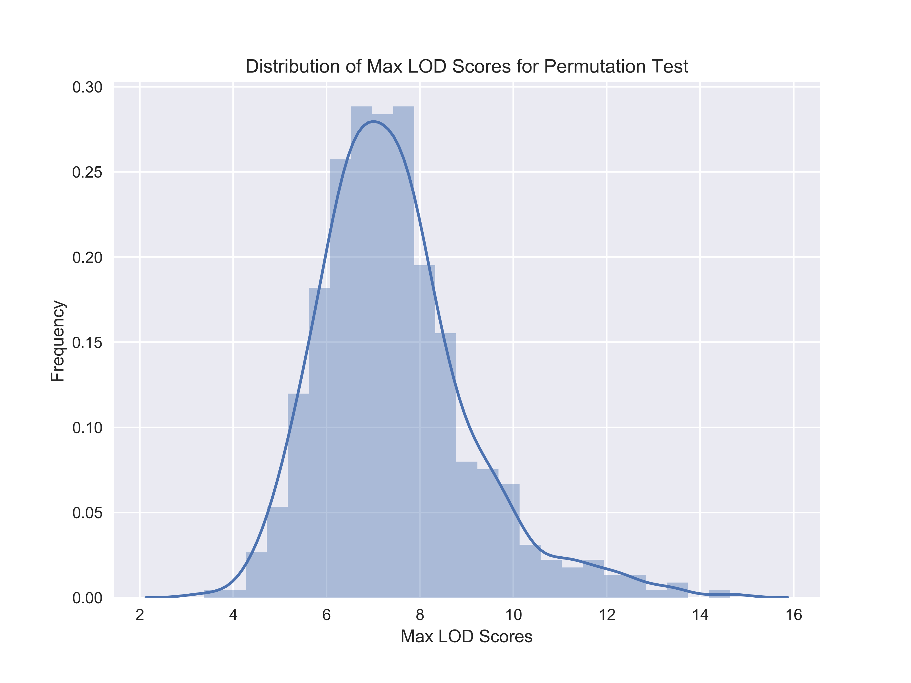
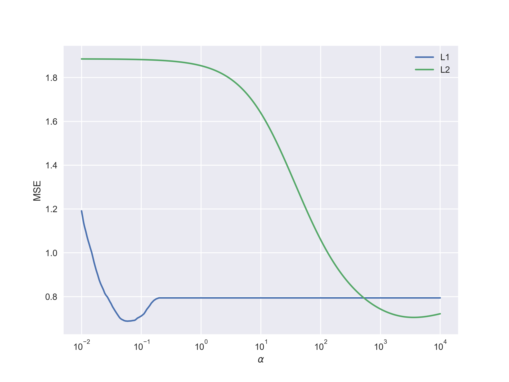
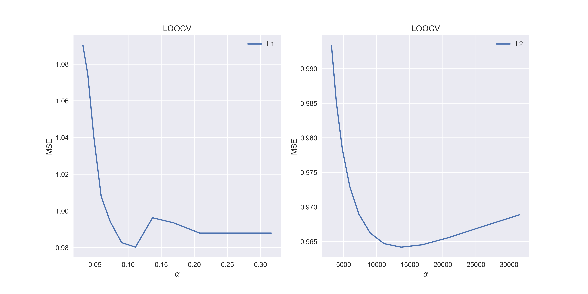
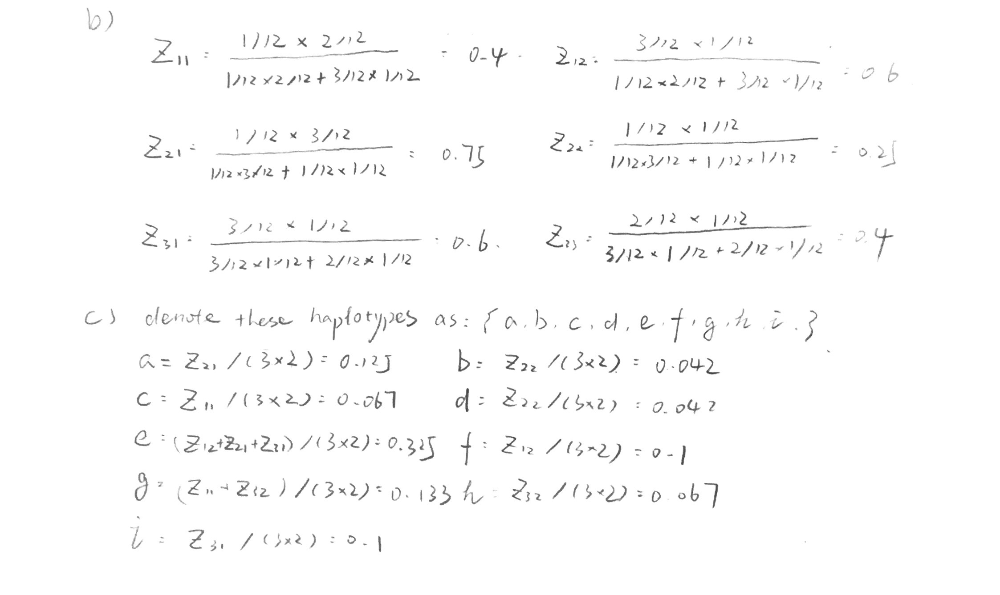

#<center>Problem Set 2</center>

*<center>Yingxin Cao</center>*

### Problem 1.

a)

​	The max LOD score is 18.2623422045. Please see .py file for implementation.

b)

​	Set the permutation size to be 500. The result is shown below.

​	<center></center>

​	The 95% threshold is 10.5652802439

c)

​	The NO. of genetic markers that have a score greater than threshold are

​	[  43  124  273  561  754  846 1123]


### Problem 2.

a)

​	The range is defined by

```python
alpht_range = np.logspace(-2, 4, 1000)
```


<center></center>

b)

​	The result is also shown in the above figure. 

​	Min MSE for lasso is 0.688103854939.
​	Min MSE for ridge is 0.70514728884.

​	L2 has higher MSE than L1.

c)

​	Due to the computation cost, less points are selected.

<center></center>

​	min MSE for lasso is 0.980266768121
​	min MSE for ridge is 0.96419177019

​	According to the result. L2 does better. 

​	The MSE are higher using LOOCV. The difference is around 0.27.

### Problem 3.

a)

​	Hidden variables: haplotypes;

​	Parameters: frequencies.

<center></center>

d)

​	Please see code for implementation.

```python
>>>Frequency:
   [ 0.167  0.     0.     0.     0.5    0.167  0.     0.     0.167]
   Probability:
   0.0,1.0
   1.0,0.0
   1.0,0.0
```

Haplotypes and corresponding frequencies are :

00010: 0.166

10011: 0.5

10101: 0.166

11111: 0.166


​	